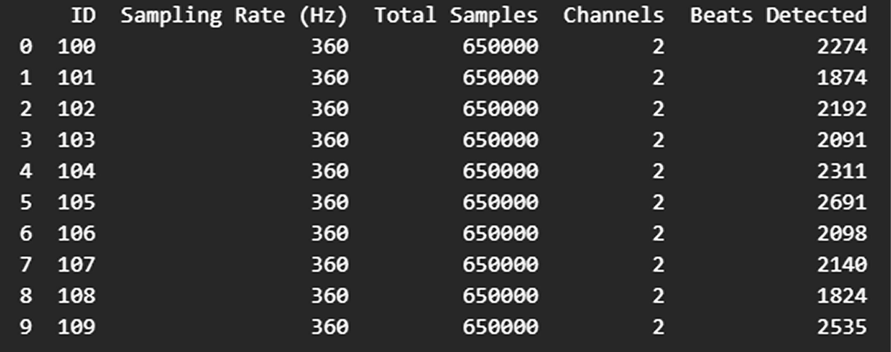

# ECG Signal Classification Using Autoencoder Features

## Problem Statement:
&nbsp;&nbsp;&nbsp;&nbsp;&nbsp;&nbsp;&nbsp;&nbsp;&nbsp;&nbsp;&nbsp;&nbsp;&nbsp;&nbsp;&nbsp;&nbsp;&nbsp;&nbsp;&nbsp;&nbsp;&nbsp;&nbsp;&nbsp;&nbsp;The aim is to classify normal and abnormal heartbeats from MIT-BIH ECG data by first using a 1D convolutional autoencoder to extract compressed heartbeat features, then training classifiers like Random Forest or XGBoost on these features. This reduces noise and dimensionality, improving efficiency and accuracy in arrhythmia detection.

## Exploratory data analysis
&nbsp;&nbsp;&nbsp;&nbsp;&nbsp;&nbsp;&nbsp;&nbsp;&nbsp;&nbsp;&nbsp;&nbsp;&nbsp;&nbsp;&nbsp;&nbsp;&nbsp;&nbsp;&nbsp;&nbsp;&nbsp;&nbsp;&nbsp;&nbsp;Each row summarizes one MIT-BIH ECG record, including its ID, sampling rate, total samples, and lead information. It also lists the number of detected heartbeats based on R-peak annotations.

  <figure>
    
    <figcaption>
      

        <b>Table 1:</b> ECG signal summary
      

    </figcaption>
  </figure>

## ECG Beat Types 

  <figure>
    
    <figcaption>
      

        <b>Figure 1:</b> Beat_types
      

    </figcaption>
  </figure>

## AAMI EC57 Standard groups    
&nbsp;&nbsp;&nbsp;&nbsp;&nbsp;&nbsp;&nbsp;&nbsp;&nbsp;&nbsp;&nbsp;&nbsp;&nbsp;&nbsp;&nbsp;&nbsp;&nbsp;&nbsp;&nbsp;&nbsp;&nbsp;&nbsp;&nbsp;&nbsp;The Association for the Advancement of Medical Instrumentation (AAMI) EC57 standard groups MIT-BIH ECG beat annotations into five classes (N, S, V, F, Q) to standardize arrhythmia classification and make research results comparable. This grouping reduces the large number of original beat types, addresses class imbalance, and reflects clinically meaningful arrhythmia categories.

  <figure>
    
    <figcaption>
      

        <b>Figure 2 :</b> Different_heart_beats
      

    </figcaption>
  </figure>

&nbsp;&nbsp;&nbsp;&nbsp;&nbsp;&nbsp;&nbsp;&nbsp;&nbsp;&nbsp;&nbsp;&nbsp;&nbsp;&nbsp;&nbsp;&nbsp;&nbsp;&nbsp;&nbsp;&nbsp;&nbsp;&nbsp;&nbsp;&nbsp;The Association for the Advancement of Medical Instrumentation (AAMI) standardizes ECG beat classification into five main groups:

**N (Normal Beats)**   
&nbsp;&nbsp;&nbsp;&nbsp;&nbsp;&nbsp;&nbsp;&nbsp;&nbsp;&nbsp;&nbsp;&nbsp;&nbsp;&nbsp;&nbsp;&nbsp;&nbsp;&nbsp;&nbsp;&nbsp;&nbsp;&nbsp;&nbsp;&nbsp;Includes normal sinus beats, left/right bundle branch block beats, and atrial escape beats.
These represent regular heart rhythms without significant abnormalities.

**S (Supraventricular Ectopic Beats)**   
&nbsp;&nbsp;&nbsp;&nbsp;&nbsp;&nbsp;&nbsp;&nbsp;&nbsp;&nbsp;&nbsp;&nbsp;&nbsp;&nbsp;&nbsp;&nbsp;&nbsp;&nbsp;&nbsp;&nbsp;&nbsp;&nbsp;&nbsp;&nbsp;Includes atrial premature beats and aberrant atrial premature beats.
Originates from the atria and occurs earlier than expected in the normal rhythm.

**V (Ventricular Ectopic Beats)**   
&nbsp;&nbsp;&nbsp;&nbsp;&nbsp;&nbsp;&nbsp;&nbsp;&nbsp;&nbsp;&nbsp;&nbsp;&nbsp;&nbsp;&nbsp;&nbsp;&nbsp;&nbsp;&nbsp;&nbsp;&nbsp;&nbsp;&nbsp;&nbsp;Includes premature ventricular contractions (PVCs) and ventricular escape beats.
Arises from the ventricles, either too early (PVC) or as a backup rhythm when higher pacemakers fail (escape).

**F (Fusion Beats)**   
&nbsp;&nbsp;&nbsp;&nbsp;&nbsp;&nbsp;&nbsp;&nbsp;&nbsp;&nbsp;&nbsp;&nbsp;&nbsp;&nbsp;&nbsp;&nbsp;&nbsp;&nbsp;&nbsp;&nbsp;&nbsp;&nbsp;&nbsp;&nbsp;;A hybrid beat created when an ectopic ventricular beat coincides with a normal beat, producing a waveform with mixed characteristics.

**Q (Unknown/Other Beats)**   
&nbsp;&nbsp;&nbsp;&nbsp;&nbsp;&nbsp;&nbsp;&nbsp;&nbsp;&nbsp;&nbsp;&nbsp;&nbsp;&nbsp;&nbsp;&nbsp;&nbsp;&nbsp;&nbsp;&nbsp;&nbsp;&nbsp;&nbsp;&nbsp;;Beats that cannot be classified into the above groups due to noise, artifacts, or rare morphologies.

  <figure>
    
    <figcaption>
      

        <b>Figure 2 :</b> Grouping_of_heart_beats
      

    </figcaption>
  </figure>

